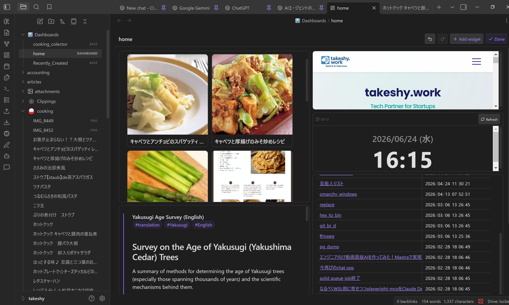
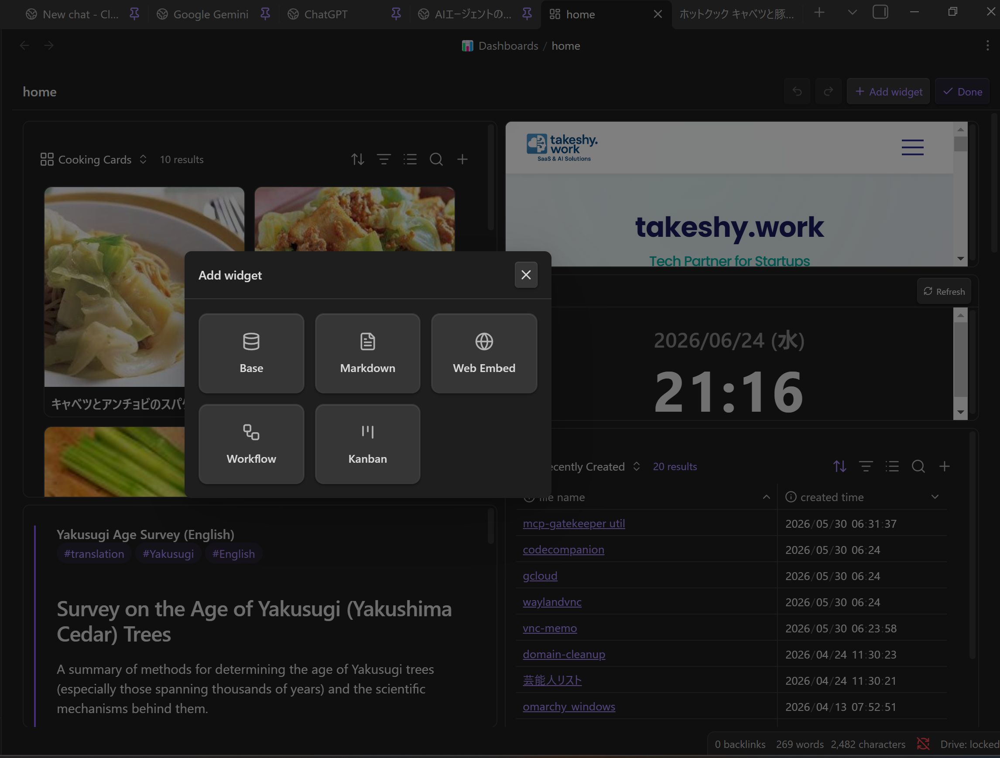
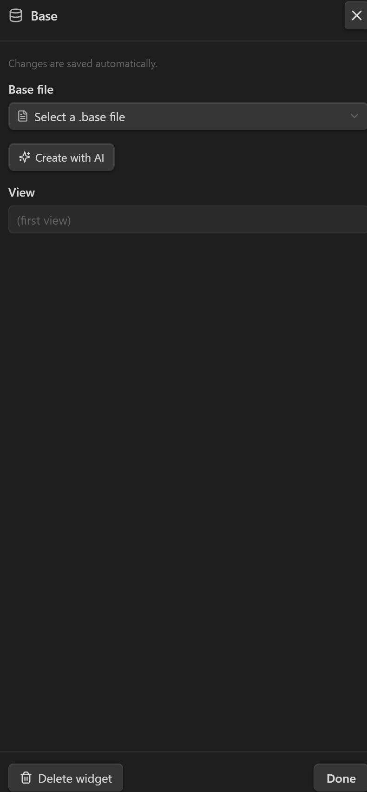
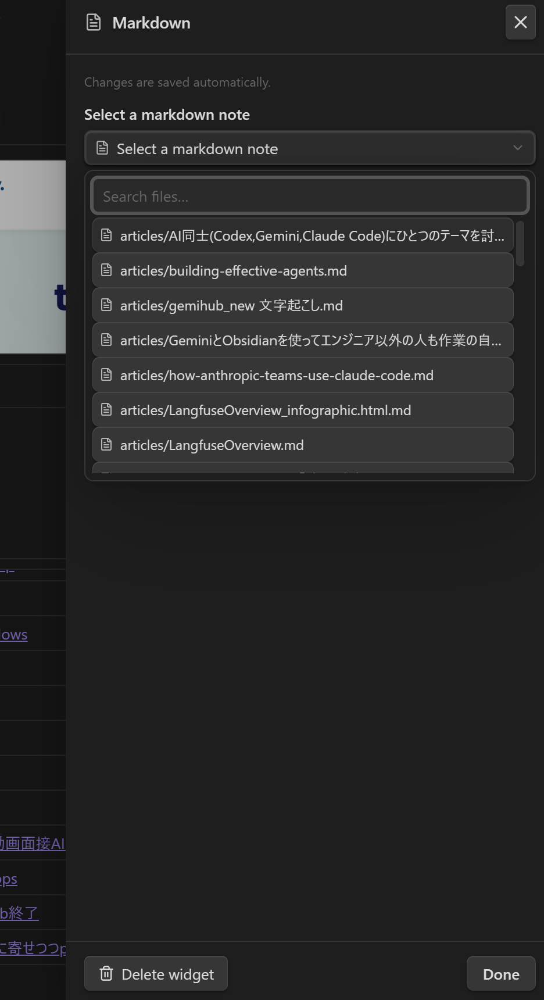
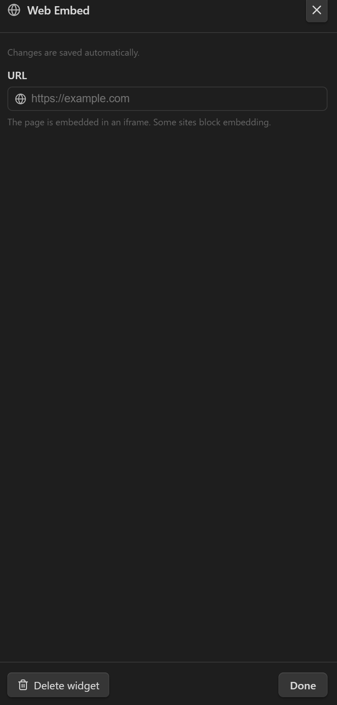
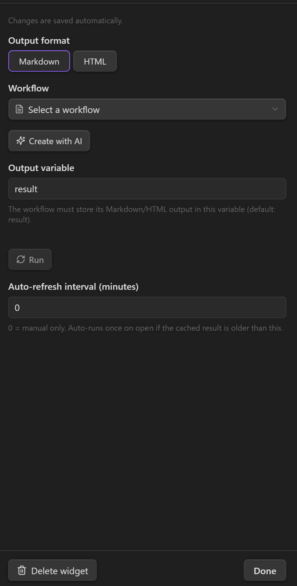
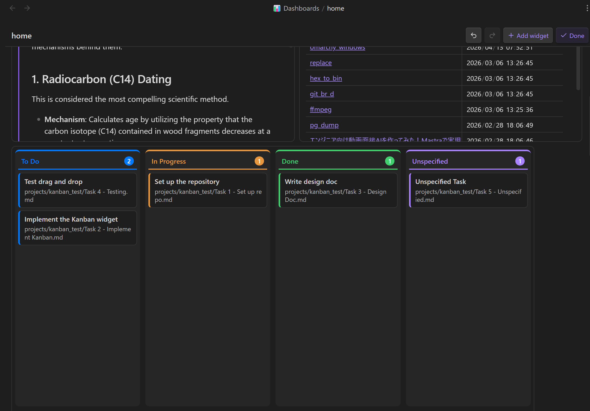
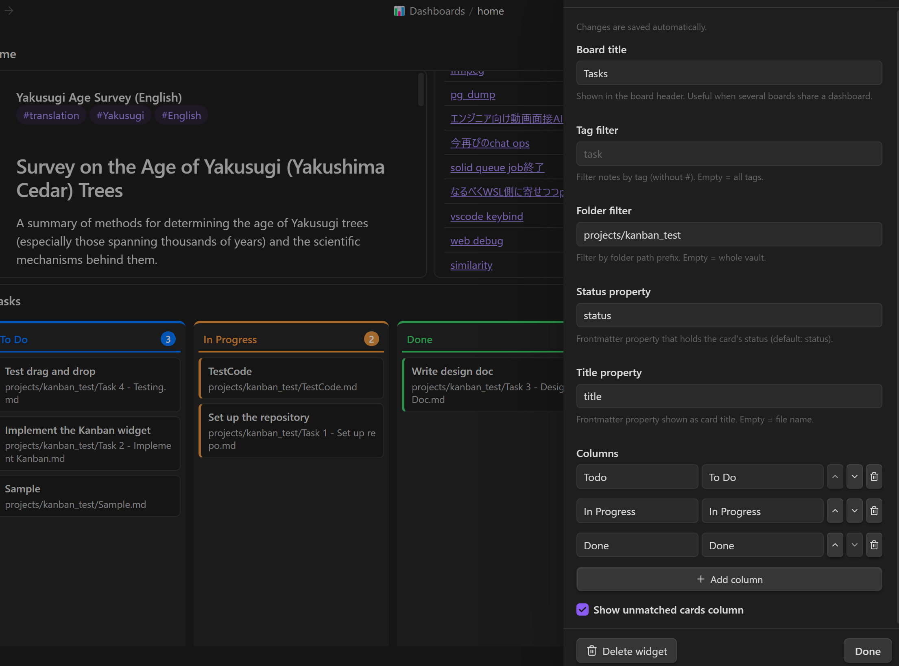

# Painel

Crie uma **página inicial / de visão geral** pessoal a partir de uma grade responsiva de widgets. Um painel é um arquivo `.dashboard` que organiza **visualizações de Bases**, **notas**, **páginas web** e **saída de workflows** em uma grade onde se arrasta e redimensiona. Abra-o como qualquer nota para obter um quadro editável ao vivo.



---

## Painel vs Canvas

O **Canvas** do Obsidian e um Painel parecem semelhantes, mas resolvem problemas diferentes:

| | Painel | Canvas |
|---|-----------|--------|
| **Conteúdo** | **Ao vivo** — As visualizações de Bases, a saída de workflows e as notas se atualizam sozinhas (baseadas em consultas) | **Estático** — os cartões são instantâneos colocados manualmente |
| **Layout** | Grade responsiva (12 colunas; reorganiza em uma única coluna em telas estreitas) | Plano infinito de forma livre com posições absolutas |
| **Propósito** | Uma **página inicial / de visão geral** estruturada que você abre para verificar o status | Um espaço para **pensar** — organizar ideias e conectá-las com setas |
| **IA** | Criado a partir do chat (a skill `dashboard` constrói o arquivo e seus dados `.base` subjacentes) | Posicionamento manual |
| **Visualização** | Um modo de visualização somente leitura que não pode ser alterado | Sempre editável |

Em resumo: use um **Painel** para uma visão geral ao vivo de relance (tarefas, resumos gerados, páginas incorporadas); use um **Canvas** para pensamento livre e espacial e relações. As compensações principais são **dinâmico vs estático** e **grade responsiva vs posicionamento livre**.

---

## Criar um painel

Há duas maneiras de criar um painel:

1. **Comando** — execute **"LLM Hub: Criar painel"** a partir da paleta de comandos. Isso cria um novo arquivo na pasta `Dashboards/` (com nome `Dashboard`, `Dashboard 2`, …) e o abre.
2. **Pedir à IA** — o plugin inclui uma skill de agente integrada **`dashboard`**. Ative-a no chat e descreva o que você quer (*"uma página inicial com minhas tarefas ativas, uma nota de boas-vindas e o clima de hoje"*). A IA cria o arquivo `.dashboard` — e quaisquer arquivos `.base` subjacentes — para você.

Os painéis são armazenados como arquivos `.dashboard` simples no seu cofre, de modo que se sincronizam e versionam como qualquer outra nota.

---

## Modo de edição

Cada painel abre no **modo de visualização**. Use a barra de ferramentas para alternar:

- **Editar** — entrar no modo de edição: arraste os widgets para movê-los, arraste o canto inferior direito de um widget para redimensioná-lo, clique na **engrenagem** para configurar um widget e na **lixeira** para excluí-lo.
- **+ Adicionar widget** — abre a paleta de widgets (somente no modo de edição).
- **Desfazer / Refazer** — percorra as alterações de layout feitas nesta sessão.
- **Concluído** — voltar ao modo de visualização.

> Todas as alterações são **salvas automaticamente** — não há um botão de salvar separado.

---

## Tipos de widget

Clique em **+ Adicionar widget** no modo de edição para escolher um tipo de widget:



### Base — incorporar uma visualização de Bases

Renderiza uma visualização nomeada de um arquivo `.base` pela **UI nativa de Bases** do Obsidian (tabela / cartões / lista / mapa). Este é o widget de dados principal — use-o para qualquer lista, tabela ou visualização em cartões de notas em vez de reimplementá-las.



| Configuração | Descrição |
|---------|-------------|
| **Arquivo base** | Caminho do cofre para o arquivo `.base` |
| **Visualização** | O nome da visualização a renderizar; deixe vazio para usar a primeira visualização da base |
| **Criar com IA** | Criar um novo arquivo `.base` (ou editar o selecionado) sem sair do painel |

O mesmo arquivo `.base` pode ser referenciado por vários widgets Base — por exemplo, um widget por visualização (Active / Done / Backlog).

### Markdown — incorporar uma nota

Renderiza uma nota Markdown existente inline como uma incorporação somente leitura (com um link para abrir a nota completa).



| Configuração | Descrição |
|---------|-------------|
| **Nota markdown** | Caminho do cofre para a nota a incorporar (seletor com busca) |

### Web Embed — incorporar uma página web

Incorpora uma página web em um iframe.



| Configuração | Descrição |
|---------|-------------|
| **URL** | A página a incorporar |

> [!NOTE]
> Alguns sites enviam cabeçalhos `X-Frame-Options` / `Content-Security-Policy` que bloqueiam a incorporação e aparecerão em branco.

### Workflow — renderizar a saída de um workflow

Executa um [workflow](WORKFLOW_NODES_pt.md) existente de forma **headless** e renderiza sua saída como Markdown ou HTML. Isso permite colocar conteúdo dinâmico e gerado (resumos, relatórios) em um painel.



| Configuração | Descrição |
|---------|-------------|
| **Formato de saída** | `Markdown` ou `HTML` (o HTML é renderizado em um iframe em sandbox) |
| **Workflow** | A nota de workflow a executar |
| **Criar com IA** | Criar um novo workflow (ou editar o selecionado) para este widget |
| **Variável de saída** | A variável do workflow que contém a string de saída (padrão `result`) |
| **Executar** | Executar o workflow agora e armazenar o resultado em cache |
| **Intervalo de atualização automática (minutos)** | `0` = somente manual; caso contrário, executa uma vez ao abrir se o resultado em cache for mais antigo que isso |

> [!IMPORTANT]
> **Os widgets de workflow renderizam a partir de um cache, não ao vivo.** Para evitar reexecutar workflows pesados toda vez que o quadro é aberto, o caminho de renderização lê **apenas** de um resultado em cache. Uma execução só ocorre quando você:
> - clica em **Executar** (no cabeçalho do widget ou no painel de configurações), ou
> - abre o painel e o resultado em cache é mais antigo que o intervalo de atualização automática.
>
> Os resultados são armazenados em um arquivo **sidecar** oculto ao lado do painel, de modo que a saída sobrevive à reabertura sem inflar o arquivo `.dashboard`. O workflow deve armazenar sua saída Markdown/HTML em uma variável de string (padrão `result`) — saídas em cartões/tabelas não são suportadas. Como é executado sem supervisão, o workflow não deve usar nós interativos (`prompt-*`, `dialog`).

### Kanban — arraste cartões para mudar o status

Renderiza as notas que correspondem a um filtro de **tag** e/ou **pasta** como cartões agrupados em colunas por uma **propriedade de status** do frontmatter. Arraste um cartão para outra coluna para atualizar o status dessa nota (gravado via `processFrontMatter`). Clique em um cartão para previsualizar sua nota em uma caixa de diálogo; o ícone de abertura da caixa abre a nota em uma nova aba. O quadro é interativo no **modo de visualização** — não é necessário entrar no modo de edição para arrastar cartões.



O cabeçalho do quadro mostra um **título** opcional (útil quando um painel contém vários quadros) e um botão **Novo**. Novo abre uma pequena caixa de diálogo para inserir o título do cartão e escolher sua coluna, e então cria uma nota que já corresponde aos filtros deste quadro — colocada na pasta configurada, com a tag configurada e definida com o status da coluna escolhida. O novo cartão aparece no quadro (você permanece no painel); clique nele quando quiser abrir a nota.

Configure o quadro nas configurações do widget no modo de edição:



| Configuração | Descrição |
|---------|-------------|
| **Título do quadro** | Exibido no cabeçalho do quadro. Útil quando vários quadros compartilham um painel. |
| **Filtro de tag** | Mostrar apenas notas com esta tag (sem `#`). Vazio = todas as tags. |
| **Filtro de pasta** | Mostrar apenas notas cujo caminho começa com este prefixo. Vazio = vault inteiro. |
| **Propriedade de status** | Propriedade do frontmatter que contém o status do cartão (padrão `status`). |
| **Propriedade de título** | Propriedade do frontmatter exibida como título do cartão. Vazio = nome do arquivo. |
| **Colunas** | Lista ordenada de valores de status. Cada coluna tem um **valor** (comparado com a propriedade) e um **rótulo** (exibido como cabeçalho). |
| **Mostrar coluna de cartões sem correspondência** | Quando ativado, os cartões cujo status não corresponde a nenhuma coluna aparecem em uma coluna adicional "Não especificado" (padrão ativado). |

Tipos de widget desconhecidos (por exemplo, de uma versão mais recente do plugin) são **preservados ao salvar** e renderizados como um espaço reservado, de modo que editar um painel desconhecido nunca perde dados.

---

## Layout responsivo

A grade tem dois pontos de quebra, alternados de acordo com a largura do contêiner:

| Ponto de quebra | Quando | Layout |
|------------|------|--------|
| **`lg`** (largo) | ≥ 768px | O layout que você organiza no modo de edição (padrão 12 colunas) |
| **`sm`** (estreito) | < 768px | Os widgets se reorganizam em uma **única coluna de largura total**, empilhados de cima para baixo |

Por padrão, o layout `sm` é **derivado automaticamente** do layout largo (ordenado por posição vertical). Se você mover widgets enquanto estiver em uma tela estreita, essas posições `sm` explícitas são mantidas e os widgets restantes preenchem os espaços ao redor delas.

---

## Criar widgets com IA

Tanto o widget **Base** quanto o **Workflow** têm um botão **Criar com IA** em seu painel de configurações:

- Para um widget **Base**, ele abre a caixa de diálogo de criação por IA para um arquivo `.base`. Se uma base já estiver selecionada, o botão se torna **Editar com IA** e a modifica.
- Para um widget **Workflow**, ele gera (ou edita) um workflow adaptado ao widget — a IA é instruída a produzir uma única string Markdown/HTML na variável de saída e a evitar nós interativos, de modo que o resultado seja renderizado de forma headless. Após a geração, o widget é **executado e atualizado automaticamente**.

Você também pode criar um painel inteiro a partir do chat usando a skill de agente integrada **`dashboard`**, que conhece o esquema `.dashboard` e a referência de criação de Bases.

---

## O formato de arquivo `.dashboard`

Um arquivo `.dashboard` é YAML. Normalmente você nunca o edita à mão (o editor visual e a IA o gerenciam), mas o esquema está documentado aqui como referência e para a segurança de ida e volta.

```yaml
version: 1
grid:
  cols: 12        # column count (default 12)
  rowHeight: 80   # pixels per grid row
  gap: 8          # pixels between cells
widgets:
  - id: <uuid>                            # unique id (UUID-like string)
    type: base | markdown | web | workflow | kanban
    layout:
      lg: { x: 0, y: 0, w: 6, h: 4 }      # required: position on the wide grid
      sm: { x: 0, y: 0, w: 12, h: 4 }     # optional: auto-derived (stacked) if omitted
    config: { ... }                       # per-widget-type config (see below)
```

- **`layout.lg`** é a posição na grade larga (≥768px). `x`/`y` são a célula superior esquerda baseada em 0; `w`/`h` são largura/altura em células da grade.
- **`layout.sm`** é a posição em telas estreitas. Omita-a para empilhar automaticamente na largura total da grade.
- Posicione os widgets de modo que não se sobreponham; empilhe-os verticalmente aumentando `y`.

### `config` por widget

```yaml
# base
config:
  base: Dashboards/Bases/Tasks.base   # vault path to the .base file
  view: Active                     # view name; omit/empty = first view

# markdown
config:
  path: Home.md                    # vault path to a markdown note

# web
config:
  url: https://example.com

# workflow
config:
  workflow: workflows/Daily Digest.md  # vault path to the workflow note
  output: markdown                     # markdown | html
  outputVariable: result               # variable holding the output string
  refreshInterval: 60                  # minutes; 0/omit = manual refresh only

# kanban
config:
  tag: task                            # optional tag filter (without #)
  folder: ""                           # optional folder path prefix
  statusProperty: status               # frontmatter property holding the status
  titleProperty: ""                    # frontmatter property for card title (empty = file name)
  columns:                             # ordered list of status values
    - value: todo
      label: To Do
    - value: in-progress
      label: In Progress
    - value: done
      label: Done
  showUnspecified: true                # show cards with no/unknown status
```

### Exemplo completo

```yaml
version: 1
grid:
  cols: 12
  rowHeight: 80
  gap: 8
widgets:
  - id: tasks-active
    type: base
    layout: { lg: { x: 0, y: 0, w: 8, h: 6 } }
    config:
      base: Dashboards/Bases/Tasks.base
      view: Active
  - id: readme
    type: markdown
    layout: { lg: { x: 8, y: 0, w: 4, h: 6 } }
    config:
      path: Home.md
  - id: docs
    type: web
    layout: { lg: { x: 0, y: 6, w: 12, h: 4 } }
    config:
      url: https://help.obsidian.md
```

---

## Dicas e observações

- **Crie os dados primeiro.** Para um widget Base, crie o arquivo `.base` (e suas visualizações) antes de apontar um widget para ele. A skill de painel por IA faz isso em uma única passagem.
- **Agrupe por visualização.** Reutilize um `.base` em vários widgets Base (Active / Done / Backlog) em vez de duplicar dados.
- **Mantenha os widgets de workflow baratos.** Eles armazenam resultados em cache; defina um **intervalo de atualização automática** sensato em vez de executá-los a cada abertura, e armazene a saída em `result`.
- **Somente desktop.** Os painéis (como o resto do plugin) funcionam no Obsidian desktop.
- **Os arquivos residem no seu cofre.** Os painéis são armazenados em `Dashboards/` como arquivos `.dashboard` e se sincronizam/versionam com suas notas; o cache de workflow por painel reside em um arquivo sidecar oculto ao lado de cada um.

> Veja também: [Nós de workflow](WORKFLOW_NODES_pt.md) · [Skills de agente](SKILLS_pt.md)
