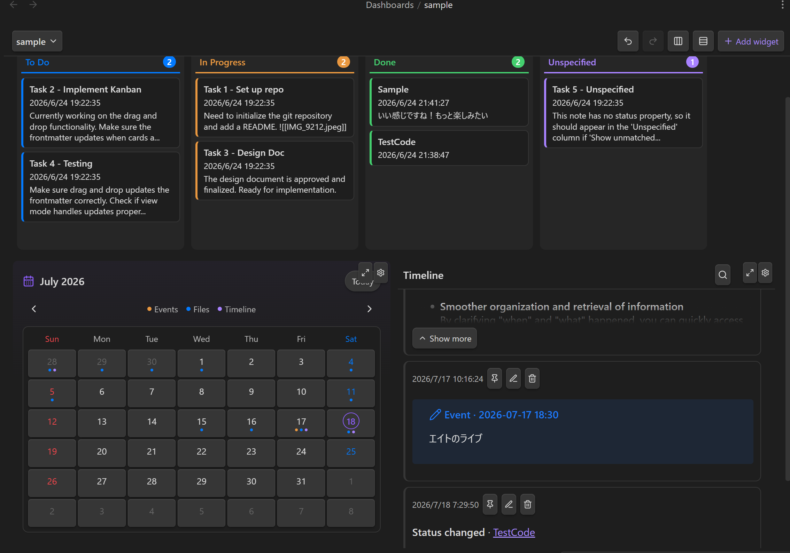

# Dashboard

A dashboard is a `.dashboard` file opened by `DashboardView`. It stores a responsive widget grid as YAML. New dashboards are created under `Dashboards/`; backing `.base` files are created under `Dashboards/Bases/`.

Users create dashboards with the command "LLM Hub: Create dashboard" or by asking chat. The built-in `dashboard` skill knows the `.dashboard` schema and can author the dashboard plus backing `.base` files.

Dashboards save edits automatically. Widgets can be dragged, resized, configured with a gear button, maximized, restored, and added with the Add widget toolbar action.

The dashboard toolbar also includes undo, redo, horizontal align, and vertical align actions. Horizontal align redistributes widgets into up to three vertical columns across the grid. Vertical align redistributes widgets into up to three horizontal rows. Both actions use the current dashboard viewport height to choose target row counts and then save the resulting large-screen layout.

Core widget types:

- Base: renders an Obsidian Bases view from a `.base` file.
- File: renders Markdown, text, HTML, images, PDF, EPUB, and other vault files with reading memo support.
- Web Embed: shows a web page in an iframe.
- Workflow: runs a workflow headlessly and renders a cached Markdown or HTML result.
- Kanban: shows notes as draggable cards grouped by a status property.
- Timeline: stores dated microblog-style posts with image attachments and AI-assisted rewriting.
- Calendar: shows Timeline events, Timeline activity, and created files by date in a fixed month view with modal day details.
- MemoList: lists reading memo files across the dashboard.

Workflow widget results are cached under `Dashboards/Data/<encoded dashboard path>.json` and refresh manually, on test run, or when stale according to the refresh interval.

# Related

- [Workflows](./workflows.md) explains workflow execution.
- [Agent Skills](./agent-skills.md) explains AI dashboard authoring.
- [Dashboard Widgets](./dashboard-widgets.md) explains each widget type in detail.
- [Dashboard Schema](./dashboard-schema.md) explains layout storage and alignment behavior.
